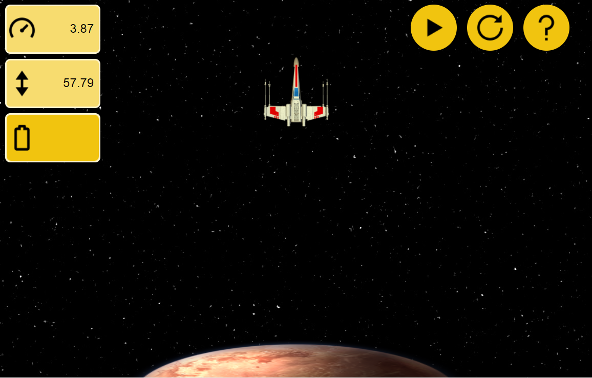

# Lunar lander con html, css y javascript
**Enlace:** https://rawgit.com/alexgaya/lunar-landing-javascript/mi-proyecto/index.html
**Autor:** Alejandro Gayá González
**Descripción:** Es un proyecto de la asignatura lenguaje de marcas, en el cual debemos desarrollar todas las funciones necesarias con javascript para que el juego Lunar lander funcione correctamente.

Se nos ha proporcionado una versión esqueleto con estas características:

* Html con los elementos básicos del juego
* Css: d.css y m.css dos versiones que cargan mediante media query dependiendo del tamaño de pantalla.
* Js: programación realista básica necesaria para dejar caer la nave y parar cuando llega a un límite. Actualiza la velocidad y la altura en %/s y % (1% de pantalla = 1 metro).
* No dispone de imágenes.

## Proyecto:
+ ##### Iconos:
Todas las imágenes de los iconos e imágenes han sido procesadas para que tengan un tamaño pequeño.  
 
 
 
 

+ ##### Botón instrucciones:
Se ha introducido un botón de instrucciones que a su vez te da la opción de ir a la página "about" para tener una pequeña descripción del proyecto.  
 
 
 

+ ##### Botón versión smartphone: 
En la versión de móvil, debido a la reducción del espacio, he tenido que modificar el panel de los botones e introducir un nuevo botón que despliegue los demás.  
 

+ ##### Botón acelerar smartphone: 
Para acelerar en la versión de móvil, he introducido un nuevo botón.  
 

+ ##### Imágen nave en movimiento:  
 

+ ##### Presentación escritorio:  
 

+ ##### Presentación smartphone:  
 
